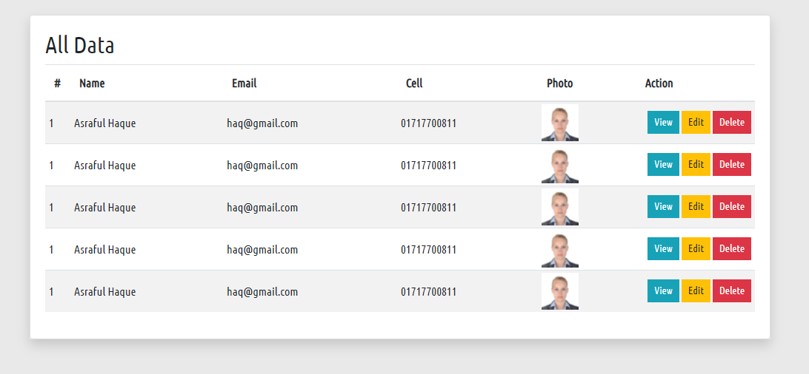

## Vue JS Crud with axios 
This is a learning purpose crud project for students



## Vue Instance 

```javaScript
const root = new Vue({
  el: '#root',
  data: {
    users: []
  },
  methods: {
    getAllUsers: function () {

      axios.get('inc/data.php').then(function (response) {

        root.users = response.data;

      });

    }
  },
  created: function () {
    this.getAllUsers();
  }
});
```